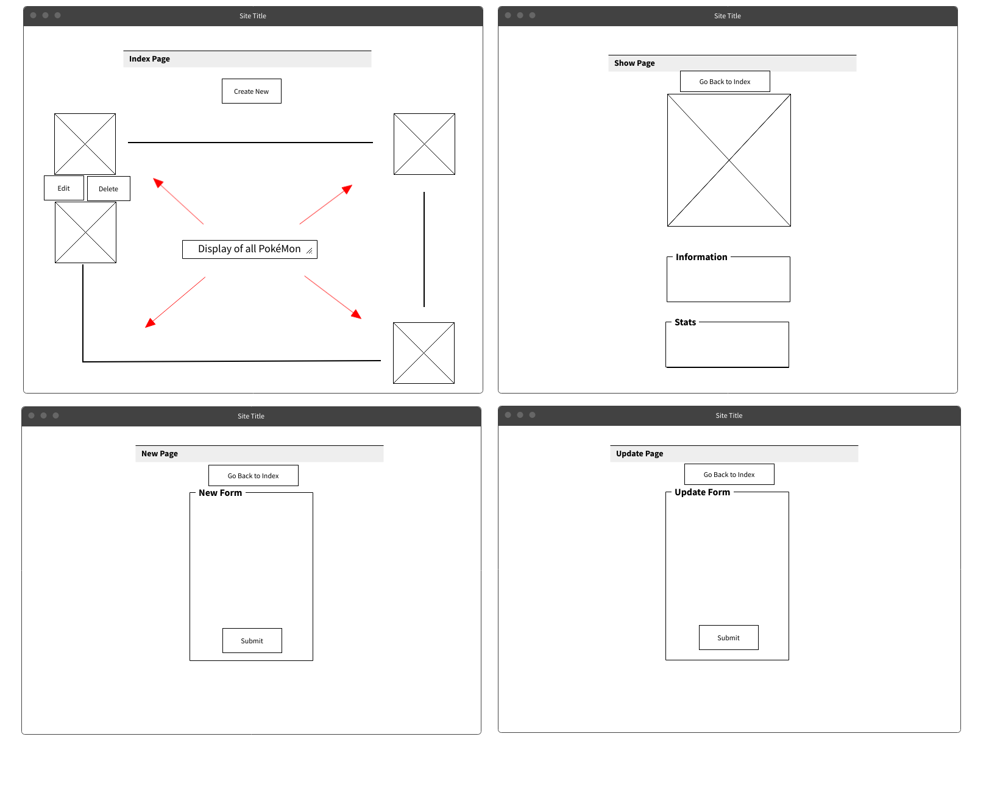
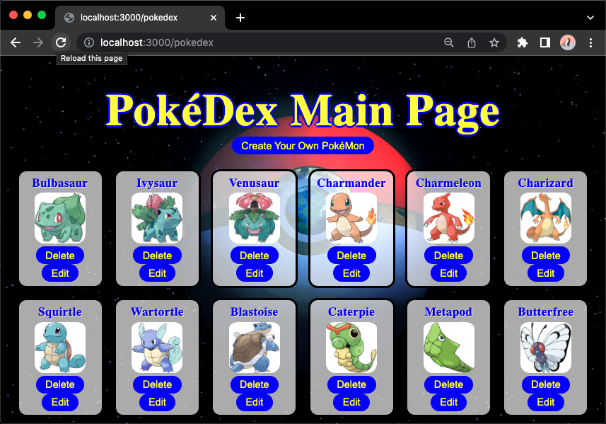
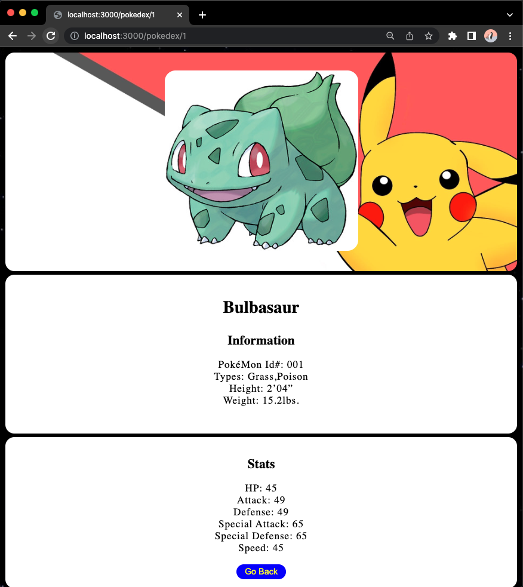
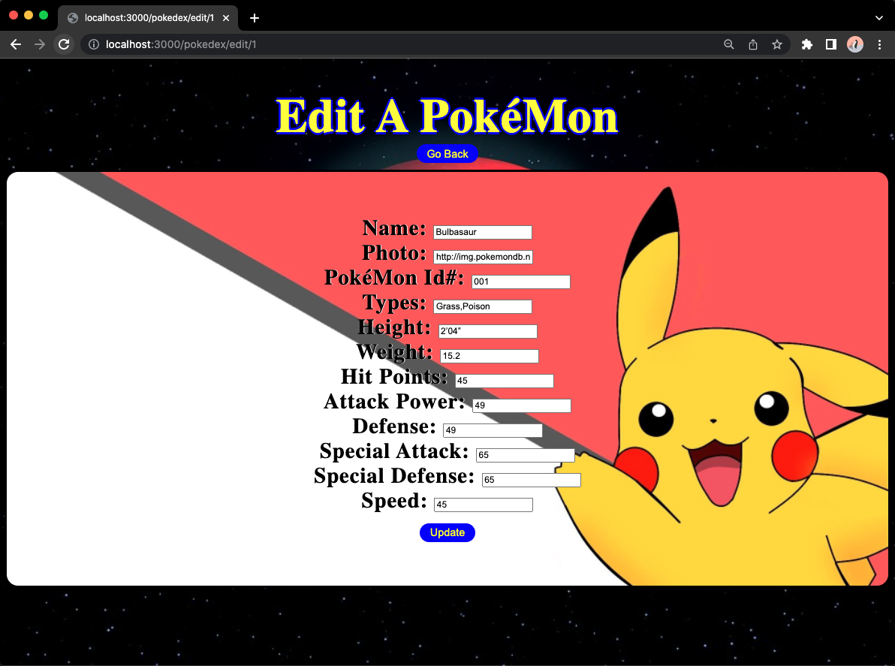

# PokéDex Made With: Express, Ejs, JavaSript, HTML, CSS

**Summary**
| Field | Detail |
|-------|--------|
| Project Name | PokéDex|
| Description | Index of Generation 1 PokéMon |
| Developers | Kyle Canamar |
| Repo | [GitHub Repo](https://github.com/kcanamar/pokedex_express) |

## User Stories

List of stories users should experience when using your application.

- Users should be able to see the site on desktop and mobile
- Users can create a new PokéMon
- Users can see all their PokéMon on the Main Page
- Users can update PokéMon
- User can delete PokéMon

## Route Tables

| Endpoint | Method | Response | Other |
| -------- | ------ | -------- | ----- |
| /pokedex | GET | JSON of all PokéMon | |
| /pokedex | POST | Create new PokéMon return JSON of new item | body must include data for new item |
| /pokedex/:id | GET | JSON of PokéMon with matching id number | |
| /pokedex/:id | PUT | update PokéMon with matching id, return its JSON | body must include updated data |
| /pokedex/:id | DELETE | delete the PokéMon with the matching id | |

## User Interface Mockups

### Wire Frame Mock Up

### Screenshots

